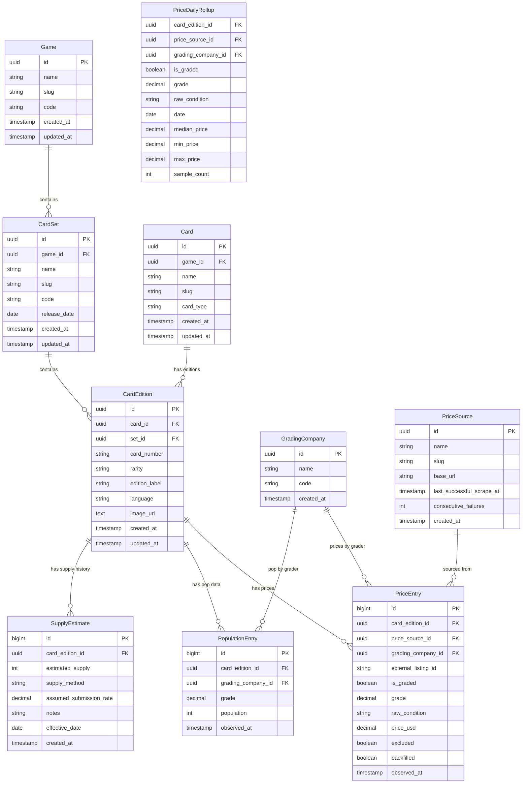

# CardCap Data Model

## Summary

**What:** A market cap tracker for trading card games. Like CoinMarketCap, but for YGO/Pokemon/MTG cards. Each card's "market cap" = supply x price.

**MVP:** YGO sets LOB through AST (~2,400 printings). PSA graded 10s and raw NM prices from eBay sold listings. Pop data from PSA. Browsable at cardcap.gg.

**Timeline:** 8-12 weeks (evenings/weekends, ~15-20 hrs/wk). Spike first, then schema, ingesters, API, frontend.

**Biggest risks:** eBay Developer Program approval delay. eBay title parsing accuracy. Supply estimation is fundamentally uncertain (5x range depending on assumed grading submission rate).

**Key uncertainty (quantified):** A LOB-001 Blue-Eyes PSA Pop of ~500 produces an estimated supply of 10,000-25,000 depending on whether the submission rate is 5% or 2%. Raw market cap swings $2M-$5M on this assumption alone. Graded market cap (real pop x real prices) is unaffected. The UI shows both, with confidence indicators on the estimated number.

---

## Core Concept

CoinMarketCap for TCGs. Each card has a "market cap" derived from supply (graded pop reports + estimated print runs) multiplied by current market price. Start with YGO sets LOB through AST, PSA 10s and raw. Schema supports Pokemon/MTG and additional grading companies later without migration.

---

## Entity Relationship Diagram



**Note:** `PriceDailyRollup` uses a composite natural key `(card_edition_id, price_source_id, grading_company_id, is_graded, grade, raw_condition, date)` as its PK with a unique constraint. No surrogate ID.

---

## Key Design Decisions

### Why CardEdition is the core entity

A single card (e.g., Blue-Eyes White Dragon) can appear in multiple sets (LOB, SDK, DDS) and have different editions within each (1st Edition, Unlimited, Limited). Each combination has independent pricing, pop data, rarity, card number, and artwork. `CardEdition` is the tradeable product.

- `card_number`: Set-specific (LOB-001 vs SDK-001).
- `rarity`: Printing-specific (Ultra Rare in LOB, Common in SDK).
- `image_url`: Printing-specific (alternate art reprints).
- `edition_label`: "1st Edition", "Unlimited", "Limited" for YGO. Maps to "Shadowless", "Unlimited" for Pokemon later. Flexible string, not an enum.
- `language`: "en", "jp", etc. Prices vary significantly by language in YGO.

`Card` holds only game-wide identity: name, slug, card_type (Monster/Spell/Trap).

### Observation tables use bigint PKs

`price_entries`, `population_entries`, and `supply_estimates` use `bigint` auto-increment PKs, not UUIDs. At 4.4M price rows/year, UUID PKs add ~16 bytes per row per index vs 8 bytes for bigint. The composite index on price_entries is 52+ bytes/entry with UUIDs vs ~28 bytes with bigints. Entity tables (cards, sets, editions) keep UUIDs since external IDs should be opaque.

### PriceDailyRollup uses composite natural key

Its identity is `(card_edition_id, price_source_id, grading_company_id, is_graded, grade, raw_condition, date)`. No two rows should share that combination. A unique constraint enforces this; no surrogate PK is needed.

### Supply estimates are versioned

`estimated_supply` and `assumed_submission_rate` do NOT live on CardEdition as mutable scalars. They live in a `supply_estimates` history table with `effective_date`. When the submission rate is adjusted from 3% to 5%, a new row is inserted. Historical market cap calculations use the supply estimate that was effective at that point in time. Without this, every rate change retroactively alters the entire market cap history.

The current supply estimate for a CardEdition is the row with the most recent `effective_date <= today`.

### Deduplication via external_listing_id

`PriceEntry` has an `external_listing_id` (string) with a unique constraint on `(price_source_id, external_listing_id)`. eBay item IDs, TCGPlayer sale IDs, etc. When scraping 2x/day, the same completed sale appears in both result sets. Without dedup, sales are double-counted, inflating sample_count and biasing medians. The ingester does `INSERT ... ON CONFLICT (price_source_id, external_listing_id) DO NOTHING`.

### Pricing model

- `PriceEntry` stores individual observed prices. One row per transaction.
- `is_graded` (boolean): graded slab vs raw card.
- `grade` (decimal, nullable): 10, 9.5, 9, etc. Only populated when `is_graded = true`.
- `raw_condition` (string, nullable): normalized to fixed vocabulary at ingestion (see Title Parsing section). Only populated when `is_graded = false`.
- `price_source_id`: FK to `PriceSource`.
- `grading_company_id`: nullable for raw card prices.
- `excluded` (boolean, default false): admin flag for outlier/scam prices. Manual override only.
- `backfilled` (boolean, default false): true for historical imports, false for live scrapes.
- `observed_at`: timestamp of the completed sale.
- `CHECK (price_usd > 0 AND price_usd < 1000000)`: rejects $0 cancelled transactions and obvious errors at insertion time.

### Market cap calculation

```
Graded Market Cap = Sum across graders: Pop(grader, grade 10) x Median Price(grader, grade 10, 90 days)
Raw Market Cap    = Current Estimated Supply x Median Price(raw NM, 90 days)
Total Market Cap  = Graded + Raw (shown separately in the UI)
```

When multiple grading companies exist, graded market cap is the **sum** of each grader's pop x price, not a combined pop x blended price. PSA 10s and BGS 10s are different products with different prices and different populations.

Supply estimation formula: `total_graded_pop_all_companies / assumed_submission_rate`. Not PSA pop alone. If PSA has 60% market share in YGO grading and the industry submission rate is 3%, using PSA pop / 0.03 overestimates supply. The correct denominator accounts for all graders.

---

## Data Sourcing Strategy

This is the hardest part of the project.

### Card Metadata (Low Risk)

**Source:** YGOPRODeck API ([https://ygoprodeck.com/api-guide/](https://ygoprodeck.com/api-guide/))

- Free, public, well-maintained API with full YGO card database
- Returns: name, card_type, set appearances, card numbers, rarities, images
- Risk: Low. Stable for years, widely used.

### Price Data (High Risk)

**Primary: eBay Browse API (sold listings)**

- Requires eBay Developer account, application registration, marketplace-specific approval.
- OAuth2 Client Credentials Grant. Tokens expire every 2 hours; the ingester needs automatic token refresh with retry logic. Budget half a day for OAuth implementation and testing.
- **Critical spike validation**: the Browse API's treatment of sold/completed items has changed across versions. The specific filter syntax (`filter=buyingOptions:{FIXED_PRICE|AUCTION}` with sold items) must be validated in the spike. If sold item access requires the deprecated Finding API instead, the ingestion architecture changes fundamentally. This is the spike's primary validation target.
- Rate limited: 5,000 calls/day on basic tier.
- Legal: API use is sanctioned. No TOS issues.

**Rate limit math and batching strategy:**

The plan has 2,400 editions scraped 2x/day. Querying per-edition would require 4,800+ calls/day (exceeding the 5,000 limit before pagination). Instead, query **per set** with broad searches:

- Query: `"LOB" yu-gi-oh sold` (one call per set per condition tier)
- 11 sets x 3 tiers (PSA 10, PSA 9, raw) x ~2 pages avg x 2 scrapes/day = ~132 calls/day
- Remaining budget: ~4,800 calls/day for backfill, retries, and future expansion
- Parse all results client-side to match against known CardEditions

This batching strategy is load-bearing. The ingester queries at set level, not card level.

**Secondary: TCGPlayer**

- Requires application and approval. Access not guaranteed.
- If denied: eBay is sufficient for Phase 1.

**Fallback: Manual entry**

- For high-value cards with <5 sales/month. Manual price entry with source attribution.

### PSA Pop Reports (Medium Risk)

- Public HTML pages. No official API. HTML scraping required.
- **Anti-scraping measures**: PSA has added CAPTCHAs and rate limiting to pop report pages. Mitigations: headless browser with stealth mode (Playwright), 5-second delays between requests, rotating user agents. For weekly scrapes of ~11 set pages, this is likely manageable.
- Store raw HTML snapshots alongside parsed data for debugging when selectors break.
- **Page structure**: PSA pop reports are organized hierarchically: game -> set -> card. Each set page has a single table listing all cards with grade distribution columns (1-10 + total). The scraper hits one page per set, parses the table rows, and maps each row to a CardEdition by card number. ~11 page requests per weekly scrape.
- **Risk-accepted decision**: PSA's TOS likely prohibits automated access. At weekly frequency on 11 pages for a hobby project, enforcement risk is low. **Fallback if PSA sends a cease-and-desist**: switch to manually transcribing pop data from the PSA website into a spreadsheet, then bulk-importing via CSV. Slower but legally clean. The schema supports this via manual PriceSource entries.

### eBay OAuth Implementation

Not a config step. Concrete requirements:

1. Register application at developer.ebay.com
2. Request Production API access (requires application review)
3. Implement Client Credentials Grant flow
4. Token refresh: tokens expire every 2 hours. The ingester must cache the token, check expiry before each batch, and refresh automatically. Refresh failures must retry with exponential backoff and alert after 3 failures.
5. Budget: half a day of implementation, tested in the spike.
6. **Approval risk**: eBay's Developer Program has gotten more restrictive. Production Browse API access for a hobby project with no existing eBay integration is not guaranteed. If approval is denied or delayed beyond 2 weeks, pivot to manual eBay price collection via CSV import while re-applying. The schema supports this via manual PriceSource entries and the `backfilled` flag.

### Scraping Frequency

| Data Type          | Source          | Frequency             | Rationale                                   |
| ------------------ | --------------- | --------------------- | ------------------------------------------- |
| Card metadata      | YGOPRODeck      | On seed + weekly sync | Cards don't change after printing           |
| Sold prices        | eBay Browse API | 2x daily              | Balances freshness vs rate limits           |
| Pop reports        | PSA HTML scrape | Weekly                | Pop counts change slowly                    |
| Daily price rollup | Cron job        | Daily (1am UTC)       | Aggregates raw prices for historical charts |
| Market cap refresh | Cron job        | Daily (2am UTC)       | Downstream of rollup + pop data             |

---

## eBay Title Parsing (The Second Hardest Problem)

eBay listing titles are unstructured and wildly inconsistent:

```
"LOB-001 Blue-Eyes White Dragon PSA 10 1st Edition"
"PSA 10 Blue Eyes White Dragon 1st Edition LOB"
"Blue-Eyes White Dragon LOB 001 GEM MINT 10 PSA First Edition"
"LOB-001 BEWD PSA10 1st Ed NM"
"LOB-001 LOB-005 PSA 10 1st Edition"  (multi-card listing)
"LOT OF 5 LOB CARDS PSA 10"           (bulk lot)
"LOB-001 ブルーアイズ PSA 10"           (Japanese)
```

### Parsing pipeline

1. **Pre-filter: bulk lot exclusion**. Reject titles matching keywords: `lot`, `bundle`, `collection`, `set of`, `x5`, `x10`, `bulk`, `grab bag`, `mystery`. Cheap first pass.
2. **Multi-card detection**. If regex matches >1 distinct card number pattern (e.g., `LOB-001` and `LOB-005`), flag for review. Do not auto-ingest.
3. **Anchor on card number**. Regex alternation is **built dynamically** from set codes in the `card_sets` table, not hardcoded. At startup, load all set codes and construct: `(LOB|MRD|MRL|...)-?(?:EN)?(\d{3})`. The optional `-EN-` infix handles the LOB-EN001 vs LOB-001 format difference (YGOPRODeck may return `LOB-EN001`; eBay titles typically use `LOB-001`). The parser normalizes both to `LOB-001` for matching. Adding new sets means inserting a row in `card_sets`, not updating code.
4. **Extract grading**. Primary regex: `(PSA|BGS|CGC|SGC)\s*(\d{1,2}(?:\.\d)?)`. Handles `PSA10`, `PSA 10`, `GEM MINT 10 PSA`. Secondary patterns: `GEM MINT` or `GEM MT` without a number implies grade 10. `PSA certified` or `PSA authenticated` without a grade implies graded but grade unknown (flag for review). If no grader keyword found, classify as raw.
5. **Extract edition**. Keywords: `1st edition`, `1st ed`, `first edition`, `1st`, `1e`, `1ed`, `unlimited`, `unlimited edition`, `unl`. **Default when no edition detected**: `unknown`. Do not guess. Listings with `unknown` edition attach to a holding CardEdition and are flagged for review.
6. **Language detection**. Check for Japanese characters (Unicode ranges \u3040-\u309F, \u30A0-\u30FF, \u4E00-\u9FFF) in the title. If present, set `language = "jp"`. Also check for explicit keywords: `japanese`, `jp`, `ocg`. Default: `en`. This is critical because Japanese LOB 1st Edition PSA 10 cards sell for 10-50x English versions. Mixing them destroys the data.
7. **Raw condition normalization**. Normalize to fixed vocabulary at ingestion:

| Input variants                                   | Normalized to |
| ------------------------------------------------ | ------------- |
| "Near Mint", "NM", "NM-Mint", "NM/M", "Mint"     | `NM`          |
| "Lightly Played", "LP", "EX", "Excellent"        | `LP`          |
| "Moderately Played", "MP", "Good", "GD"          | `MP`          |
| "Heavily Played", "HP", "Damaged", "DMG", "Poor" | `HP`          |

If raw condition cannot be determined from the title, default to `NM` (most eBay raw singles are listed as NM). Flag for review if price is <60% or >200% of the current NM median for that edition. A $30 sale on a card with a $50 NM median likely indicates LP/MP condition, not a cheap NM.

**Known bias**: An estimated 40-60% of raw eBay listings omit condition entirely, all defaulting to NM. This contaminates the NM median with LP/MP sales. A $35 LP sale on a $50 NM card falls within the 60-200% band and would be ingested as NM unchallenged. Expected impact: NM median biased downward by roughly 5-15% for cards with active raw markets. TCGPlayer's structured condition field would eliminate this entirely, which is the primary reason it's listed as a secondary source. Until then, this is an accepted limitation — the bias is consistent across cards and doesn't distort relative rankings.

8. **Confidence scoring**. Weighted formula:

| Signal                            | Weight | Score                                          |
| --------------------------------- | ------ | ---------------------------------------------- |
| Card number matched in database   | 0.35   | 1.0 if match, 0.0 if no match                  |
| Grade extracted                   | 0.20   | 1.0 if extracted, 0.0 if raw (not penalized)   |
| Edition extracted (not "unknown") | 0.20   | 1.0 if known, 0.3 if unknown                   |
| Single card (not multi/lot)       | 0.15   | 1.0 if single, 0.0 if flagged                  |
| Language detected                 | 0.10   | 1.0 if explicit signal, 0.5 if defaulted to EN |

**Initial weights, subject to spike calibration.** These are starting values chosen by intuition (card number match is most important signal). After the spike, real data may shift the weights. The fixture set's false positive/negative rates determine the final calibration.

Threshold: >= 0.70 auto-ingest, < 0.70 goes to review queue. Both the threshold and weights are calibrated during the spike against labeled fixtures.

9. **Validation**. Parsed (card_number, edition_label, grading_company, grade, language) must match a known CardEdition + GradingCompany in the database. Unmatched listings go to review queue.

### Testing strategy

Build a labeled fixture set during the spike:

- 100+ real eBay sold listing titles, manually labeled with expected parse output
- Categories: clean titles, messy titles, bulk lots, multi-card, Japanese, no edition, misspellings
- Run parser against fixtures as a regression suite in CI
- When new listing patterns emerge that break parsing, add them to fixtures and fix
- Track parse accuracy metrics: % auto-ingested, % flagged for review, % false positives

**TBD -- design during spike**: Exact regex patterns may need tuning based on real eBay data. The parsing pipeline structure is fixed; the patterns within each step are calibrated empirically.

---

## Supply Estimation (The Hardest Problem)

Konami does not publish print run numbers. Supply estimation is the most important and least reliable input to the market cap formula.

### What we actually know

- **Graded population**: PSA (and eventually BGS, CGC) pop reports give exact counts per grade. Real data.
- **Submission rate**: Industry estimates suggest 1-5% of cards in existence get graded, varying by era and value.

### Estimation methods

Each `SupplyEstimate` row has a `supply_method` field:

| Method              | Description                                                    | Reliability |
| ------------------- | -------------------------------------------------------------- | ----------- |
| `pop_derived`       | `Total Pop(all graders, all grades) / assumed_submission_rate` | Low-medium  |
| `industry_estimate` | Published estimates from analysts, auction houses, or Konami   | Medium      |
| `manual`            | Hand-entered with source citation in `notes`                   | Varies      |
| `unknown`           | No estimate. Raw market cap not calculable.                    | N/A         |

### Versioned supply estimates

Supply estimates are stored in the `supply_estimates` table with `effective_date`, not as mutable fields on CardEdition. When the submission rate is adjusted from 3% to 5%, a new row is inserted with a new effective_date. Historical market cap uses the estimate that was effective at that time. This preserves the integrity of market cap history.

### Grading company summation

```
Total Graded Pop = PSA Pop(all grades) + BGS Pop(all grades) + CGC Pop(all grades)
Estimated Supply = Total Graded Pop / assumed_submission_rate
```

NOT `PSA Pop / assumed_submission_rate`. If the 3% industry estimate includes all grading companies and PSA has 60% market share, using PSA pop alone overestimates supply by ~1.67x.

For Phase 1 (PSA only), this is moot. But the formula must be correct from day one so adding BGS doesn't silently break all estimates. When BGS is added, the supply estimate gets a new row with recalculated numbers.

### Calibration

The 3% assumption is a starting point. Two signals can improve it over time:

- **eBay listing volume vs pop data**: A card with 50 graded copies but 200 raw eBay listings/month suggests a lower submission rate.
- **Relative ratios within a set**: Two cards with similar pop counts but different eBay volumes indicate different submission rates.

**Acknowledged limitation**: These signals are partially circular. eBay listing frequency tells you about cards that get listed, not total supply. Absolute supply estimates remain educated guesses. Relative comparisons within a set are more reliable than absolute numbers.

`assumed_submission_rate` is stored per SupplyEstimate row and revisited quarterly.

### Per-rarity default rates

The blanket 3% default is wrong for commons. High-value chase cards get graded at dramatically higher rates than $2 commons. Default rates by rarity tier for LOB-AST era:

| Rarity Tier | Default Rate | Rationale |
|-------------|-------------|-----------|
| Ultra Rare / Secret Rare | 5% | High value, collectors actively grade |
| Super Rare | 3% | Moderate value, some grading activity |
| Rare | 1% | Low value, minimal grading incentive |
| Common / Short Print | 0.5% | Almost never graded unless misprints |

**These are the author's estimates based on observed PSA pop distributions across LOB-AST rarity tiers, not published industry figures.** No reliable public source for per-rarity submission rates exists. Treat as starting assumptions to be calibrated during Phase 1 as real data accumulates — particularly by comparing pop-derived supply estimates against eBay listing volumes across rarity tiers within the same set.

Cards below a grading-volume threshold (PSA Pop < 10 across all grades) default to `supply_method = 'unknown'` and show no raw market cap. No point estimating supply for a card nobody submits.

### External validation sources

Absolute supply estimates are educated guesses, but partial validation exists:

- **Auction house catalog notes**: Heritage Auctions and PWCC occasionally cite estimated populations for high-end lots. These are expert opinions, not verified data, but they're independent from our pop-derived estimates.
- **Konami tournament registration data**: Konami has published aggregate registration numbers for certain sets in rare promotional materials. Unlikely to find, but worth flagging as `industry_estimate` if discovered.
- **Cross-referencing across grading companies**: When BGS data is added, if PSA + BGS total pop implies a very different submission rate than PSA alone, that's a calibration signal.

None of these are systematic. The honest answer is that absolute supply is unverifiable for most cards. The UI reflects this.

### Sensitivity analysis

**Chase card** (LOB-001 Blue-Eyes White Dragon 1st Edition, PSA Pop ~500 across all grades):

| Submission Rate | Estimated Supply | Raw Market Cap (at $200 raw NM median) |
|-----------------|-----------------|----------------------------------------|
| 2% | 25,000 | $5,000,000 |
| 3% | 16,667 | $3,333,400 |
| 5% | 10,000 | $2,000,000 |
| 10% | 5,000 | $1,000,000 |

**Common card** (LOB-047 Mystic Clown, PSA Pop ~5 across all grades):

| Submission Rate | Estimated Supply | Raw Market Cap (at $2 raw NM median) |
|-----------------|-----------------|--------------------------------------|
| 0.5% | 1,000 | $2,000 |
| 1% | 500 | $1,000 |
| 3% | 167 | $334 |

The common card illustrates two things: (1) the absolute numbers are plausible at any rate, making validation impossible; (2) the raw market cap is too small to matter. This is why cards with PSA Pop < 10 should default to `unknown` supply.

A 2% vs 10% rate assumption on a chase card creates a **5x range** in raw market cap. This is why the UI must show confidence indicators and let users adjust the rate. Graded market cap (real pop x real prices) is unaffected.

### Display strategy

- Graded market cap: shown with high confidence.
- Raw market cap: shown with "Estimated" badge, tooltip explaining method and assumed rate.
- User can adjust submission rate slider and see market cap recalculate.
- Never present estimated supply as fact.

---

## Data Quality and Error Handling

### Price outliers

- **IQR filtering at rollup time, not ingestion time**. All non-excluded price entries are stored as-is. The daily rollup job computes IQR on the 90-day window and excludes outliers when calculating median. This avoids premature exclusion when sample sizes are small (a price that looks like an outlier with 3 data points may be normal with 20). The `excluded` boolean on PriceEntry is for manual admin overrides only, not automated filtering.
- **Median over mean**: Rollup computes median, not average.
- **Minimum sample size**: Require 3+ non-excluded sales in the window. Below that, show "Insufficient data."
- **CHECK constraint**: `price_usd > 0 AND price_usd < 1000000` rejects $0 cancelled transactions and obvious errors at insertion.

### Deduplication

`PriceEntry` has a unique constraint on `(price_source_id, external_listing_id)`. The ingester uses `INSERT ... ON CONFLICT (price_source_id, external_listing_id) DO NOTHING`. Since eBay's rolling window returns the same completed sales across multiple scrapes, this is the primary defense against double-counting.

**Tradeoff acknowledged**: `DO NOTHING` silently drops updates. If eBay adjusts a completed listing's final price after initial ingestion (e.g., partial refund), the correction is lost. For eBay completed sales this is almost certainly fine (final prices are final), but it's a stated assumption. If corrections matter in the future, switch to `DO UPDATE SET price_usd = EXCLUDED.price_usd WHERE price_entries.price_usd != EXCLUDED.price_usd`.

### Ingestion idempotency

Each ingester (price, pop, metadata) is idempotent:

- **Price ingester**: dedup via `external_listing_id`. Crashes mid-batch are safe because individual inserts within the batch use ON CONFLICT DO NOTHING. No partial state.
- **Pop ingester**: change detection. Only inserts a new `PopulationEntry` if the count differs from the most recent snapshot for that (edition, grader, grade). If pop decreases (which shouldn't happen except for re-grading), log a warning and insert anyway for auditability.
- **Metadata ingester**: upsert by card_number + set_id. Idempotent by nature.

Batch boundaries: each scrape job wraps its inserts in a transaction. If the job crashes, the transaction rolls back. No partial ingestion.

**Per-row error handling within batches**: A single malformed row (bad timestamp, FK violation from a race condition with metadata sync, encoding issue) should not kill the entire batch. Strategy: pre-validate each parsed row before adding to the batch (check card_edition_id exists, observed_at parses, price_usd passes CHECK). Invalid rows are logged with the raw listing data and skipped. The batch transaction contains only validated rows.

### Pop report change detection

- On each weekly scrape, compare new pop counts against the most recent `PopulationEntry` per (edition, grader, grade).
- If unchanged: skip insert (saves storage, population_entries stays lean).
- If increased: insert new row with new timestamp. Normal behavior.
- If decreased: insert new row AND log a warning. Pop decreases indicate re-grading, crossover, or data errors. Worth investigating.
- Growth rate: with change detection, ~11 set pages x ~50 cards x ~5 grade buckets = ~2,750 potential rows/week, but most are unchanged. Expect ~200-500 new rows/week in practice.

### Scrape failure handling

- `PriceSource.last_successful_scrape_at` and `consecutive_failures` track health.
- 3 consecutive failures = warn (structured log). 7 = pause source, show "Stale data" in UI.
- Price data shows `as of [date]` in the UI.

### Freshness indicators

- No price data in 90+ days: "No recent sales"
- Pop report older than 30 days: "Pop data may be outdated"

### Data reconciliation

Monthly manual check (Phase 1): search eBay directly for "LOB PSA 10 sold" and compare the result count against `price_entries` for LOB graded-10 in the same period. Significant divergence (>20%) indicates the parser or ingester has a systematic bug (silently dropping listings, failing to paginate, etc.). Automate this in Phase 2 by comparing the eBay API result count header against ingested row count per scrape batch.

### Parse accuracy monitoring

The observability table tracks `% auto-ingested vs flagged` with a >30% flagged threshold. More granular: track **week-over-week change** in flagged rate. A steady 25% flagged rate is expected (some listings are genuinely ambiguous). A jump from 15% to 30% in one week indicates either a parser regression or a new listing pattern that needs a fixture.

---

## Retention and Partitioning

`price_entries` at ~12K rows/day = ~4.4M rows/year.

### Strategy

- **Partition by month** on `observed_at` using PostgreSQL native range partitioning.
- **Hot** (current month): current-price lookups.
- **Warm** (last 12 months): raw data available but most queries hit the rollup.
- **Cold** (12+ months): archive or drop raw rows. Rollup preserves daily aggregates permanently.

### Rollup table

`price_daily_rollup`: composite PK `(card_edition_id, price_source_id, grading_company_id, is_graded, grade, raw_condition, date)`. Populated nightly at 1am UTC. IQR filtering applied during rollup computation. Historical charts beyond 90 days query rollup, not raw entries.

---

## API Layer

### Design

- **Public, read-only, no authentication.** Reference site, not SaaS. No user accounts for Phase 1.
- **REST** served by Go backend (Golid/Echo).
- **CORS**: `Access-Control-Allow-Origin: *` for public read-only API. Set in Echo middleware.
- **Cache**: `Cache-Control: public, max-age=900` (15-minute TTL). Cloudflare edge caching. No application-level cache needed at this scale.

### Endpoints

| Method | Path                          | Description                                                                                                                  |
| ------ | ----------------------------- | ---------------------------------------------------------------------------------------------------------------------------- |
| GET    | `/api/v1/games`               | List games                                                                                                                   |
| GET    | `/api/v1/games/:slug/sets`    | Sets for a game, sorted by market cap desc. Params: `sort` (market_cap, name, release_date), `order` (asc, desc)             |
| GET    | `/api/v1/sets/:code`          | Set detail with top 10 cards by market cap                                                                                   |
| GET    | `/api/v1/sets/:code/cards`    | Cards in a set. Params: `sort` (market_cap, price, name, card_number), `rarity`, `is_graded` (filter), `page_size` (max 200) |
| GET    | `/api/v1/editions/:id`        | Card edition detail with price history chart data                                                                            |
| GET    | `/api/v1/editions/:id/prices` | Price history, cursor-paginated                                                                                              |
| GET    | `/api/v1/search?q=`           | Search cards by name (pg_trgm)                                                                                               |

Slug-based convenience routes (better for sharing/SEO):

- `/api/v1/cards/:game/:set_code/:card_number/:edition` resolves to the edition UUID internally
- Example: `/api/v1/cards/ygo/LOB/001/1st-edition`
- Edition slug convention: lowercase, hyphens for spaces. "1st Edition" -> `1st-edition`, "Unlimited" -> `unlimited`, "Limited" -> `limited`. Lookup table in code, not a DB slug column (too few values to warrant storage).
- Card number in URL uses the bare number without set prefix: `001` not `LOB-001` (set code is already in the path).

### Market cap response schema

The market cap is the core product. Its API representation:

```json
{
  "graded_market_cap_usd": 125000.00,
  "raw_market_cap_usd": 3333400.00,
  "total_market_cap_usd": 3458400.00,
  "raw_confidence": "estimated",
  "supply_method": "pop_derived",
  "assumed_submission_rate": 0.03,
  "graded_pop_total": 500,
  "estimated_supply": 16667,
  "price_as_of": "2026-03-03T02:00:00Z",
  "pop_as_of": "2026-02-28T00:00:00Z"
}
```

This is included in set-level and edition-level responses. `raw_confidence` is "high" (industry_estimate source), "estimated" (pop_derived), or null (unknown supply). Timestamps let the UI show freshness.

### Pagination

Cursor-based on `observed_at` (not offset; offset degrades on large tables).

- Cursor: `observed_at` of last item.
- Page size: 50 default, max 200.
- Request: `?cursor=2026-03-01T12:00:00Z&page_size=50`
- Response: `{ "data": [...], "next_cursor": "2026-02-28T08:30:00Z", "has_more": true }`

All list endpoints use the same envelope.

### Search

`/api/v1/search?q=blue+eyes` uses PostgreSQL `pg_trgm` on `cards.name`. Handles typos and partial matches. Returns Card objects with their editions nested (limited to top 5 editions by market cap per card to keep response size bounded).

Requires: `CREATE EXTENSION pg_trgm` and `CREATE INDEX idx_cards_name_trgm ON cards USING gin (name gin_trgm_ops)`.

### Error responses

All errors use a consistent envelope:

```json
{
  "error": {
    "code": "not_found",
    "message": "Card edition not found"
  }
}
```

| HTTP Status | Code             | When                                            |
| ----------- | ---------------- | ----------------------------------------------- |
| 400         | `bad_request`    | Invalid params (bad cursor, invalid sort field) |
| 404         | `not_found`      | Resource doesn't exist                          |
| 429         | `rate_limited`   | Exceeded 60 req/min per IP                      |
| 500         | `internal_error` | Unhandled server error                          |

### Rate limiting

60 req/min per IP via Echo middleware. Cloudflare also enforces at the edge.

### Versioning

v1 is the only version. If breaking changes are needed (response schema changes, removed fields, changed pagination format), deploy v2 at a new path (`/api/v2/`) and maintain v1 for 6 months with a `Sunset` header. For non-breaking additions (new fields, new endpoints), extend v1 in place.

### Backfill support

The price ingester accepts `--backfill --from=2025-01-01` to page through historical eBay sold listings. Backfill imports are tagged `backfilled = true` on PriceEntry so they can be distinguished from live scrapes in analysis. Not needed for Phase 1 but the schema supports it.

---

## Observability

| What               | How                                       | Alert Threshold                       |
| ------------------ | ----------------------------------------- | ------------------------------------- |
| Scrape failures    | `PriceSource.consecutive_failures`        | 3 = warn, 7 = pause source            |
| Market cap refresh | Cron logs success/failure + row count     | Failure or 0 rows = alert             |
| Price rollup       | Cron logs success/failure + row count     | Failure = alert                       |
| API latency        | Echo middleware p50/p95 per endpoint      | p95 > 500ms = investigate             |
| Database size      | Monthly partition size check              | >10M rows = run cold archival         |
| Data staleness     | Editions with no prices in 90 days        | Count increasing = scraper broken     |
| Parse accuracy     | Weekly report: % auto-ingested vs flagged | Flagged rate >30% = parser regression |

**Market cap view refresh uses `REFRESH MATERIALIZED VIEW CONCURRENTLY`**. If the 2am refresh crashes mid-computation, the previous day's data remains fully intact and continues serving API queries. Without `CONCURRENTLY`, a failed refresh would leave the view empty or locked. This means a refresh failure results in stale-by-one-day data (acceptable), not missing data (unacceptable).

Phase 1: structured log output. Email/PagerDuty when the site has real users.

---

## Infrastructure and Deployment

| Component                    | Service                                                | Rationale                                                |
| ---------------------------- | ------------------------------------------------------ | -------------------------------------------------------- |
| Go backend + API             | Cloud Run (steve-build project or new cardcap project) | Same infra as Golid, zero-to-scale, no server management |
| PostgreSQL                   | Cloud SQL (Postgres 16, db-f1-micro for Phase 1)       | Managed, supports partitioning, pg_trgm                  |
| Cron jobs (scrapers, rollup) | Cloud Scheduler triggering Cloud Run jobs              | No always-on instance needed                             |
| Frontend                     | Cloud Run (SolidJS SSR via Golid)                      | Same deploy pipeline as steve.build                      |
| CDN / DNS                    | Cloudflare (cardcap.gg already configured)             | Edge caching, rate limiting, SSL                         |
| Domain                       | cardcap.gg (Namecheap registration, Cloudflare DNS)    | Already purchased and configured                         |

### CI/CD

- GitHub repo. Push to main triggers Cloud Build.
- Cloud Build: run tests, build Docker image, deploy to Cloud Run.
- Same pattern as Golid's existing deploy.sh.

### Local development

- `docker-compose.yml` with Postgres 16 + pg_trgm extension, matching Cloud SQL config.
- `make seed` script to populate local DB with YGOPRODeck data.
- Scrapers accept `--dry-run` flag: fetch and parse but don't insert. For testing against real APIs without polluting the DB.
- Golid's existing Makefile targets (`make dev`, `make test`) work unchanged.

### Backups

Cloud SQL automated daily backups with 7-day retention (enabled by default on all Cloud SQL instances). Point-in-time recovery available. No additional backup infrastructure needed for Phase 1.

### Cost estimate (Phase 1)

| Service                          | Monthly Cost      |
| -------------------------------- | ----------------- |
| Cloud Run (backend, low traffic) | ~$5               |
| Cloud SQL (db-f1-micro)          | ~$8 (upgrade to db-g1-small at ~$25/mo if rollup job exceeds 5 min) |
| Cloud Scheduler (3 cron jobs)    | ~$0.30            |
| Cloudflare (free plan)           | $0                |
| eBay API                         | Free (basic tier) |
| **Total**                        | **~$13/mo**       |

---

## Tables Summary

| Table                | PK Type   | Purpose                                  | Starting Rows |
| -------------------- | --------- | ---------------------------------------- | ------------- |
| `games`              | uuid      | YGO, Pokemon, MTG                        | 1             |
| `card_sets`          | uuid      | LOB through AST                          | ~11           |
| `cards`              | uuid      | Unique cards                             | ~1,200        |
| `card_editions`      | uuid      | Printings per card per set               | ~2,400        |
| `grading_companies`  | uuid      | PSA (then BGS, CGC)                      | 1             |
| `price_sources`      | uuid      | eBay, TCGPlayer                          | 1-2           |
| `supply_estimates`   | bigint    | Versioned supply + rate per edition      | ~2,400        |
| `price_entries`      | bigint    | Price observations (partitioned monthly) | ~12K/day      |
| `price_daily_rollup` | composite | Daily aggregates                         | ~2.4K/day     |
| `population_entries` | bigint    | Pop report snapshots                     | ~200-500/week |

## Indexes

- `price_entries`: composite `(card_edition_id, grading_company_id, is_graded, grade, observed_at DESC)` for graded price lookups
- `price_entries`: partial index `WHERE is_graded = false` on `(card_edition_id, raw_condition, observed_at DESC)` for raw price lookups (avoids NULL grading_company_id scan issues)
- `price_entries`: partial index `WHERE observed_at > now() - interval '90 days'` for hot path
- `price_entries`: unique `(price_source_id, external_listing_id)` for dedup
- `population_entries`: composite `(card_edition_id, grading_company_id, grade, observed_at DESC)`
- `supply_estimates`: composite `(card_edition_id, effective_date DESC)` for current estimate lookup
- `cards`: `(game_id, slug)` and GIN `(name gin_trgm_ops)` for search
- `card_editions`: `(card_id, set_id, edition_label)` and `(set_id, card_number)`
- `price_daily_rollup`: `(card_edition_id, grading_company_id, is_graded, grade, date DESC)`

---

## Phase 1 Seed Data (YGO LOB-AST)

| Code | Set Name                         | Release    |
| ---- | -------------------------------- | ---------- |
| LOB  | Legend of Blue Eyes White Dragon | 2002-03-08 |
| MRD  | Metal Raiders                    | 2002-06-26 |
| MRL  | Magic Ruler                      | 2002-09-16 |
| PSV  | Pharaoh's Servant                | 2002-10-20 |
| LON  | Labyrinth of Nightmare           | 2003-03-01 |
| LOD  | Legacy of Darkness               | 2003-06-06 |
| PGD  | Pharaonic Guardian               | 2003-07-18 |
| MFC  | Magician's Force                 | 2003-10-10 |
| DCR  | Dark Crisis                      | 2003-12-01 |
| IOC  | Invasion of Chaos                | 2004-03-01 |
| AST  | Ancient Sanctuary                | 2004-06-01 |

---

## Execution Order with Time Estimates

| Step | Task                    | Duration | Exit Criteria                                                                                                                    |
| ---- | ----------------------- | -------- | -------------------------------------------------------------------------------------------------------------------------------- |
| 1    | **Data sourcing spike** | 3-4 days | All three sources return usable data. eBay OAuth works. Parser accuracy >80% on 100 labeled fixtures. PSA pop page parseable.    |
| 2    | **eBay title parser**   | 3-4 days | Parser module with confidence scoring. 100+ fixture regression suite in CI. Bulk lot, multi-card, language detection all tested. |
| 3    | **SQL schema**          | 1-2 days | All 10 tables created with indexes, partitioning, constraints. Migrations run clean.                                             |
| 4    | **Seed card data**      | 1 day    | LOB-AST cards + editions populated from YGOPRODeck.                                                                              |
| 5    | **Price ingester**      | 3-4 days | eBay sold listings flowing in. Dedup working. Integration test: scrape, parse, insert, verify no dupes on re-run.                |
| 6    | **Pop ingester**        | 2 days   | PSA pop data for LOB-AST ingested. Change detection working.                                                                     |
| 7    | **Market cap + rollup** | 2 days   | Daily rollup cron, market cap view, both verified with known inputs.                                                             |
| 8    | **API layer**           | 3-4 days | All 7 endpoints live with sorting, filtering, pagination, error handling. API integration tests.                                 |
| 9    | **Frontend**            | 5-7 days | SolidJS homepage (Golid), card detail, price charts, search. Deployed to Cloud Run behind cardcap.gg.                            |

**Total estimate: 8-12 weeks** (evenings/weekends at ~15-20 hours/week). The 8-week path assumes eBay approval is fast and no major surprises in the spike. The 12-week path accounts for eBay approval delays, parser tuning iterations, and debugging time. No slack built in for scope creep.

### Testing strategy (beyond parser)

- **Price ingester integration test**: mock eBay API response, verify parse + dedup + insert. Verify re-run inserts 0 new rows.
- **Market cap calculation test**: seed known prices + known pop data, verify market cap output matches hand-calculated expected values.
- **API endpoint tests**: standard request/response tests for each endpoint, including error cases (404, bad params).
- **Rollup test**: seed price_entries with known data including outliers, verify rollup correctly applies IQR and computes expected medians.

### Admin interface

Phase 1: raw SQL for admin actions (excluding prices, adjusting supply estimates, reviewing flagged listings). Phase 2: admin UI in the Golid app with a review queue for low-confidence parsed listings and a supply estimate editor.

---

## Not In Scope (Phase 1)

These are explicitly deferred, not forgotten:

- **User accounts / authentication**: Public reference site. No login.
- **Admin UI**: Raw SQL for Phase 1. Admin panel is Phase 2.
- **Pokemon / MTG**: Schema supports it. Data sourcing and seeding deferred.
- **BGS / CGC grading**: Schema supports it. Pop report scrapers deferred.
- **Price alerts / notifications**: Requires user accounts.
- **Mobile app**: Responsive web only.
- **Revenue model**: No ads, subscriptions, or affiliate links in Phase 1.
- **Historical backfill**: Schema supports it via `backfilled` flag. Implementation deferred.
